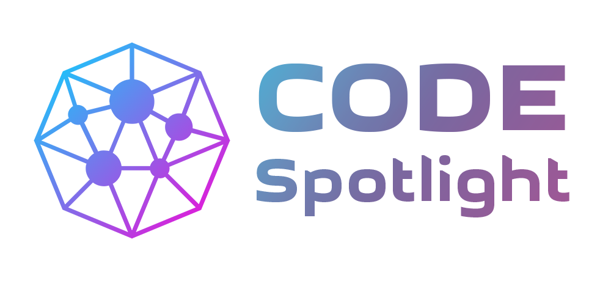

# CodeSpotlight

Website Repository

[](https://codespotlight.dev)

This is the **official open-source repository** for [codespotlight.dev](https://codespotlight.dev) – the central platform of the CodeSpotlight ecosystem.

## About CodeSpotlight.dev
The website serves as a **showcase and gateway** to the different parts of CodeSpotlight, including:
- **[codespotlight.dev](https://codespotlight.dev)** – Main showcase site. 
- **[tools.codespotlight.dev](https://tools.codespotlight.dev)** – Collection of practical developer tools. 
- **[react.codespotlight.dev](https://react.codespotlight.dev)** – A curated showcase of verified React projects.
- **[angular.codespotlight.dev](https://angular.codespotlight.dev)** – A curated showcase of verified Angular projects.
- **[open-source.codespotlight.dev](https://react.codespotlight.dev)** – The Open Source Internship Program.
- **...and more to come!**


## Tech Stack
- **Angular** – Frontend framework
- **Angular Material UI** – Modern and responsive UI components
- **Netlify** – Hosting and deployment

## Contributing
We welcome **issues, feature requests, and PRs** to improve CodeSpotlight.dev! Check out our **[Contributing Guide](CONTRIBUTING.md)** for details on how to get started.

## License
This project is **open-source** under the [MIT License](LICENSE).

---

### Connect with Us
🌐 Website: [CodeSpotlight.dev](https://codespotlight.dev) 

💬 Discord: [Join the community](https://discord.gg/wZyNsP9n6S)
__________________________________________________________


This project was generated using [Angular CLI](https://github.com/angular/angular-cli) version 19.1.0.

## Development server

To start a local development server, run:

```bash
ng serve
```

Once the server is running, open your browser and navigate to `http://localhost:4200/`. The application will automatically reload whenever you modify any of the source files.

## Code scaffolding

Angular CLI includes powerful code scaffolding tools. To generate a new component, run:

```bash
ng generate component component-name
```

For a complete list of available schematics (such as `components`, `directives`, or `pipes`), run:

```bash
ng generate --help
```

## Building

To build the project run:

```bash
ng build
```

This will compile your project and store the build artifacts in the `dist/` directory. By default, the production build optimizes your application for performance and speed.

## Running unit tests

To execute unit tests with the [Karma](https://karma-runner.github.io) test runner, use the following command:

```bash
ng test
```

## Running end-to-end tests

For end-to-end (e2e) testing, run:

```bash
ng e2e
```

Angular CLI does not come with an end-to-end testing framework by default. You can choose one that suits your needs.

## Additional Resources

For more information on using the Angular CLI, including detailed command references, visit the [Angular CLI Overview and Command Reference](https://angular.dev/tools/cli) page.
