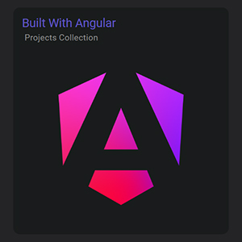
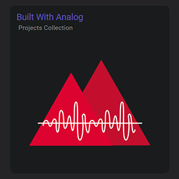

# TechShowcase

Welcome to TechShowcase, your platform for showcasing a variety of projects built with Angular and Analog.

## Repositories

|  |  |
|:--:|:--:|
| This repository is dedicated to showcasing projects built with Angular. Whether it's open source, free to use, or a paid project, [builtwithangular.dev](https://builtwithangular.dev) provides a platform for developers to showcase their work. | This repository is dedicated to showcasing projects built with AnalogJS. Whether it's open source, free to use, or a paid project, [builtwithanalog.dev](https://builtwithanalog.dev) provides a platform for developers to showcase their work. |

## Purpose

TechShowcase aims to provide a space for developers to showcase their projects to the community. While our main focus is on open source and free-to-use projects, we also support developers who wish to list and sell their projects.

### Open Source & Free Projects

We encourage developers to submit their open source and free-to-use projects to TechShowcase. These projects are essential for fostering collaboration and innovation within the developer community.

### Paid Projects

In addition to free projects, TechShowcase also allows developers to list and sell their paid projects. This provides an opportunity for developers to earn income from their work while still benefiting from the exposure our platform offers.

## How to Showcase your Project

To showcase your project, just head over to [Discussions](https://github.com/orgs/TechShowcase/discussions/) and follow the instructions outlined in [Submitting a project](https://github.com/orgs/TechShowcase/discussions/1).

