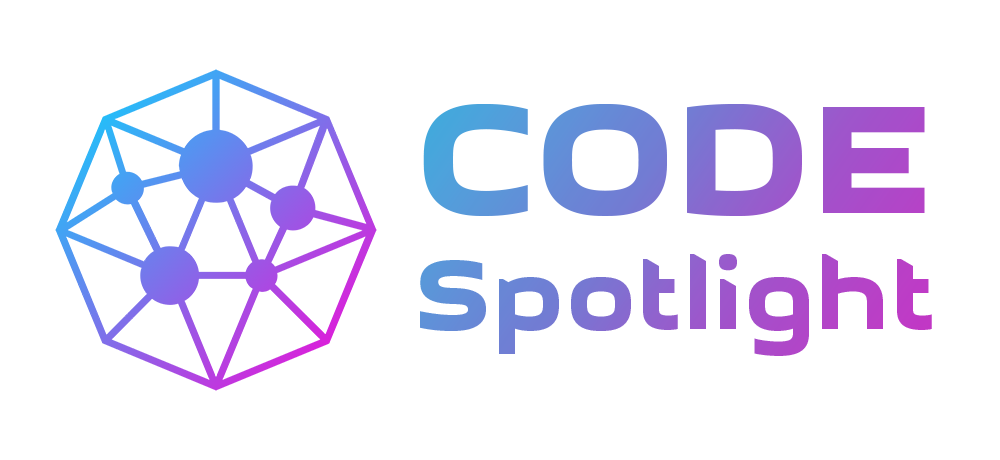

# Code Spotlight 
## Open Source Internship Program

Welcome to the **Code Spotlight Open Source Internship Program!** This initiative is designed to merge the real-world experience of open-source contributions with an **internship framework**, providing participants with structured learning, hands-on collaboration, and an official credential for their efforts.  

---

### **What Makes This Program Unique?**
- **Open-Source Roots**: The program revolves around contributing to real-life open-source projects, which inherently emphasize collaboration, transparency, version control, and coding discipline.  
- **Internship Framework**: Unlike traditional open-source contributions, this program formalizes your experience with:
  - Clear learning goals.
  - Defined tracks based on skillsets and technologies.
  - An official acknowledgment (internship certificate) upon successful completion.
- **Welcomes Diverse Contributions**: Contributions are welcome from anyone - whether you're officially part of the internship or contributing externally to the project. Open-source thrives on community involvement, and we embrace that.

---

### **Available Tracks**
We currently offer the following tracks under the program. Each track emphasizes core technologies while embedding fundamental open-source principles like version control via **Git**, collaborative coding on **GitHub**, and team communication.

#### 1. **Frontend - Angular**
   - Learn to create dynamic and interactive web applications using Angular.
   - Work with TypeScript, HTML, and SCSS.
   - Contribute to real-world Angular-based open-source projects.

#### 2. **Frontend - Next.js**
   - Work with React-based Next.js to build server-rendered web applications.
   - Learn about concepts like API routes, static generation, and SSR (Server-Side Rendering).
   - Build scalable, fast projects for open-source ecosystems.

#### 3. **Backend - Node.js**
   - Dive into backend development with Node.js and Express.js.
   - Contribute to building REST or GraphQL APIs.
   - Learn to handle server-side logic, database integrations, and authentication processes.

---

### ⏳ **Flexible Duration**
The program is designed to suit a variety of schedules:
- **Duration**: Flexible, ranging from **2 to 6 months**.
  - If you have more time available, you may complete the program faster (e.g., within 2 months).
  - If you have a busy schedule, you can work at a slower pace, spreading your participation over 6 months.
- **Why Flexible?** We accommodate participants’ personal commitments (e.g., jobs, studies) while ensuring that everyone has the chance to learn and contribute meaningfully.

---

### ** This Is Unpaid Internship**
The Code Spotlight Open Source Internship is **not a paid internship**, and here’s why:
1. **Merge With Open Source**: Open-source development, by its nature, is typically unpaid and thrives on the voluntary contributions of developers globally.
2. **Focus on Learning and Collaboration**: The primary goal is to give participants hands-on experience in real-world collaboration, teamwork, and development - a priceless opportunity to enhance your portfolio and skills.

---

### **Program Goals**
1. Provide participants with **real-life collaborative development experience through open source** involvement.
2. Empower developers to work on **real-world projects** where their code creates impact.
3. Make **open-source contributions** more accessible, structured, and recognized.
4. Create a **career-building internship experience** that’s both challenging and flexible.

---

### **Who Can Join?**
This program is open to all!  
- **As an Intern**: Apply, select your track (frontend or backend), and officially join the internship program. You'll receive structured mentorship and certification at the end.  
- **As a Contributor**: Anyone can still contribute to projects without formally being part of the internship—you’ll be part of our community and valuable to the project’s success.

---

### **How to Get Started**
1. Explore your interests:
   - Would you like to focus on **Frontend Development** (Angular/Next.js) or **Backend Development** (Node.js)?
2. Prepare your environment:
   - Familiarize yourself with Git and GitHub (if you’re not already comfortable).
   - Study the basics of your chosen technology stack.
3. Join the Program:
   - [Application Link/Instructions to Join]
4. Start contributing:
   - Work on tasks, collaborate with your peers via GitHub, and grow your skills!

---

### **Contributions**
Contributions are the backbone of this program and the open-source ecosystem. Whether you're joining as an intern or contributing outside the formal program, your involvement is deeply valued.

You can:
- Report bugs.
- Fix issues in existing repositories.
- Build new features.
- Contribute to documentation or community initiatives.  

Every contribution matters and brings value to the community. **Let’s build impactful projects together!**

---

### **Contact and Queries**
Have questions or want to learn more about the program? Reach out to us via:
- [Email/Contact Link]
- [Discord/Slack Community Link]

---

We’re excited to have you here. Together, let’s shine a light on your coding journey and make open source a pivotal part of your growth story! 🚀